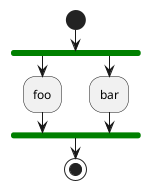
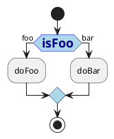

```puml
@startuml

skinparam Activity {
    BackgroundColor Green
}

start
:foo;
end

@enduml
```

```puml
@startuml

skinparam Activity {
    BorderColor Green
    BorderThickness 5
}

start
:foo;
stop

@enduml
```

```puml
@startuml

skinparam Activity {
    EndColor Green
}

start
:foo;
stop

@enduml
```

```puml
@startuml

skinparam Activity {
    FontColor DarkBlue
    FontName Arial
    FontSize 18
    FontStyle Bold
}

start
:foo;
stop

@enduml
```

```puml
@startuml

skinparam Activity {
    StartColor Green
}

start
:foo;
stop

@enduml
```

```puml
@startuml

skinparam Activity {
    Shape<<Foo>> Octagon
    Shape<<Bar>> RoundBox
}

(*) --> "foo" << Foo >>
"foo" --> "bar" << Bar >>
"bar" --> (*)

@enduml
```

# Activity

<table>
    <thead>
    <tr>
        <th>Group</th>
        <th>skinparam</th>
        <th>Diagram</th>
        <th>Source</th>
    </tr>
    </thead>
    <tbody>
        <tr>
            <td><code>Background</code></td>
            <td><code>BackgroundColor</code></td>
            <td></td>
<td>

</td>
        </tr>
        <tr>
            <td><code>Bar</code></td>
            <td><code>BarColor</code></td>
            <td></td>
<td>

</td>
        </tr>
        <tr>
            <td><code>Border</code></td>
            <td>
                <code>BorderColor</code> 
                <code>BorderThickness</code>
             </td>
            <td></td>
<td>

</td>
        </tr>
        <tr>
            <td><code>Diamond</code></td>
            <td>
                <code>DiamondBackgroundColor</code> 
                <code>DiamondBorderColor</code> 
                <code>DiamondFontColor</code> 
                <code>DiamondFontName</code> 
                <code>DiamondFontSize</code> 
                <code>DiamondFontStyle</code>
            </td>
            <td></td>
<td>

</td>
        </tr>
        <tr>
            <td><code>End</code></td>
            <td><code>EndColor</code></td>
            <td></td>
<td>

</td>
        </tr>
        <tr>
            <td><code>Font</code></td>
            <td>
                <code>FontColor</code> 
                <code>FontName</code> 
                <code>FontSize</code> 
                <code>FontStyle</code>
            </td>
            <td></td>
<td style="text-align: center">

</td>
        </tr>
        <tr>
            <td><code>Start</code></td>
            <td><code>StartColor</code></td>
            <td></td>
<td style="text-align: center">

</td>
        </tr>
        <tr>
            <td>
            <code>Shape</code> 
            </td>
            <td><code>Shape</code> </td>
            <td></td>
<td style="text-align: center">
not supported in Activity Beta syntax

</td>
        </tr>
    </tbody>
</table>
