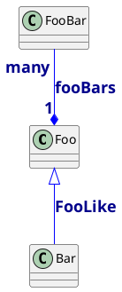
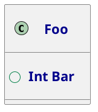

```puml
@startuml
skinparam ClassBackgroundColor Blue\Green
class Foo {
}
@enduml
```

```puml
@startuml
skinparam ClassBorder {
  Color Green
  Thickness 5
}
class Foo {
}
@enduml
```

```puml
@startuml
skinparam ClassFont {
  Color DarkBlue
  Name Arial
  Size 18
  Style Bold
}
class Foo {
}
@enduml
```

```puml
@startuml
skinparam ClassHeaderBackgroundColor Green
class Foo {
}
@enduml
```

```puml
@startuml
skinparam ClassStereotypeFont {
Color DarkBlue
  Name Arial
  Size 18
  Style Bold
}
class Foo << Bar >> {
}
@enduml
```

# Class

<table xmlns="http://www.w3.org/1999/html">
    <thead>
    <tr>
        <th>Group</th>
        <th>skinparam</th>
        <th>Diagram</th>
        <th>Source</th>
    </tr>
    </thead>
    <tbody>
<tr>
            <td><code>Arrow</code></td>
            <td><code>Color</code> <code>Font*</code></td>
            <td></td>
<td>

</td>
    </tr>
<tr>
            <td><code>Attribute</code></td>
            <td><code>Font*</code> <code>IconSize</code></td>
            <td></td>
<td>

</td>
        </tr>
        <tr>
            <td><code>Background</code></td>
            <td><code>Color</code></td>
            <td></td>
<td>

</td>
    </tr>
    <tr>
                <td><code>Border</code></td>
                <td><code>Color</code> <code>Thickness</code></td>
                <td></td>
<td>
    

</td>
        </tr>
            <tr>
            <td><code>Font</code></td>
            <td><code>Color</code> <code>Name</code> <code>Size</code> <code>Style</code></td>
            <td></td>
<td>

</td>
        </tr>
        <tr>
            <td><code>Header</code></td>
            <td><code>Background*</code></td>
            <td></td>
<td>

</td>
    </tr>
        <tr>
            <td><code>Stereotype</code></td>
            <td><code>Font*</code></td>
            <td></td>
<td>

</td>
        </tr>
    </tbody>
</table>

